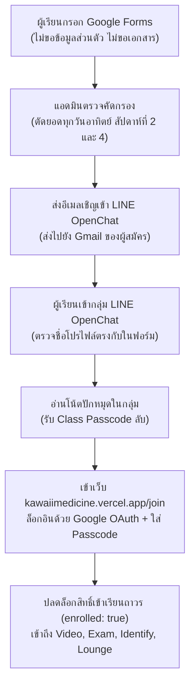

# KawaiiMedicine — Student Registration Form Specification & AI Prompts

> **สถานะ:** Active (Canonical Reference)  
> **ไฟล์ต้นทาง:** `docs/registration-form.md`  
> **ใช้สำหรับ:** แบบฟอร์มรับสมัครเข้าคลาสเรียนฟรี KawaiiMedicine ผ่าน Google Forms

---

## 🎯 1. ภาพรวมและขั้นตอนการรับสมัคร (Onboarding Architecture)



---

## 🤖 2. Google Forms AI Prompts (พร้อมใช้งานทันที)

นำ Prompt ด้านล่างไปวางในฟีเจอร์ **"Help me create a form" (สร้างแบบฟอร์มด้วย AI)** ใน Google Forms:

### 🇹🇭 เวอร์ชันภาษาไทย (แนะนำ)

```text
สร้างแบบฟอร์ม Google Forms ลงทะเบียนเรียนฟรี "Register forms for Free medical class by KawaiiMedicine" น้ำเสียงเป็นกันเอง อบอุ่น สไตล์พี่ติวน้อง ตรงไปตรงมา ไม่ถามข้อมูลส่วนตัว ไม่ขอชื่อ-นามสกุลจริง ไม่ขอเอกสารยืนยันตัวตน เปิดรับตั้งแต่ ม.ต้น, ม.ปลาย, จนถึงมหาวิทยาลัย ปี 1-3 โดยแบ่งเป็น 4 ส่วน ดังนี้:

[คำอธิบายหัวแบบฟอร์ม]
"ฟรี ไม่มีค่าใช้จ่าย พี่สอนเอง สอนแบบพี่ติวน้อง ฟรีตลอด เพียงน้องแสดง attention อย่างสม่ำเสมอ 
โปรดอ่านข้อปฏิบัติ: 
! ข้อ 1 น้องจะให้ attention ในการตอบ forms และเรียนรู้สม่ำเสมอ อย่างน้อย 60%
! ข้อ 2 น้องเข้าสอบและฝึกทำโจทย์สม่ำเสมอทุก 2 สัปดาห์
ขั้นตอนสมัคร:
1. กรอกข้อมูลใน form นี้
2. รอรับผลและ Link Open Chat ทาง Gmail (โปรดตรวจสอบในกล่อง Junk/ถังขยะ ด้วยนะครับ)
หมายเหตุ: การตัดสินใจรับเข้าขึ้นอยู่กับการตัดสินใจของพี่เพียงอย่างเดียว การตั้งใจเขียนตอบจะทำให้พี่รู้จักน้องมากขึ้นนะ
พี่จะตัดยอดทุกๆ วันอาทิตย์ ของสัปดาห์ที่ 2 และ 4 ของเดือนครับ
ช่องทางติดต่อกรณีเร่งด่วน: fn4.tanatorn@gmail.com"

Part 1 : แนะนำตัวและเป้าหมาย (ทำความรู้จักน้องๆ)
- Short answer: ชื่อเล่น หรือชื่อที่อยากให้พี่เรียก
- Multiple choice: ระดับชั้นการศึกษาปัจจุบัน (ตัวเลือก: มัธยมศึกษาตอนต้น, มัธยมศึกษาตอนปลาย / เตรียมสอบแพทย์ / สอวน.ชีวะ, มหาวิทยาลัย ปี 1 Pre-med, มหาวิทยาลัย ปี 2 Pre-clinic, มหาวิทยาลัย ปี 3 Pre-clinic เตรียมสอบ NL1, อื่นๆ)
- Short answer: โรงเรียน หรือ มหาวิทยาลัย (ระบุหรือไม่ระบุก็ได้)
- Long answer: ความฝันของน้องคืออะไร?
- Long answer: น้องคาดว่า การสอนและระบบเว็บของพี่ จะมีประโยชน์กับน้องอย่างไร?

Part 2 : ลงทะเบียนสำหรับใช้ระบบเว็บ KawaiiMedicine
คำอธิบาย: "สำหรับใช้เข้า Web เพื่อดูวิดีโอ ทำโจทย์ และทายภาพชิ้นเนื้อ"
- Short answer: บัญชีอีเมล Google Account (Gmail หรืออีเมลสถานศึกษา) สำหรับใช้กด Sign in with Google เข้าเว็บไซต์ KawaiiMedicine
- Short answer: ชื่อโปรไฟล์ใน LINE OpenChat ที่จะใช้เข้าร่วมกลุ่ม (เพื่อให้พี่ตรวจสอบอนุมัติรับเข้ากลุ่ม และใช้รับรหัสเข้าคลาส)

Part 3 : ข้อมูลเพื่อพัฒนาต่อ
- Multiple choice: น้องรู้จัก/ได้รับ Link forms สมัคร จากที่ใด? (ตัวเลือก: LINE OpenChat, Facebook, TikTok, X/Twitter, เพื่อน/รุ่นพี่แนะนำ, ลิงก์จากหน้าทดลองเรียน Demo)

Part 4 : ข้อตกลงร่วมกัน
- Multiple choice: รับทราบเงื่อนไข ข้อที่ 1: น้องจะให้ attention ในการตอบ forms รวบรวมความเห็นเพื่อพัฒนาการสอน และเรียนรู้สม่ำเสมอ อย่างน้อย 60% (ตัวเลือกเรียงตามนี้: 1. ไม่สามารถปฏิบัติได้, 2. ยินดี ปฏิบัติอย่างยิ่ง)
- Multiple choice: รับทราบเงื่อนไข ข้อที่ 2: น้องจะเข้าสอบและฝึกทำโจทย์สม่ำเสมอทุก 2 สัปดาห์ หากขาดโดยไม่แจ้ง พี่จะขออนุญาตปล่อยที่ว่างให้เพื่อนคนอื่น (ตัวเลือกเรียงตามนี้: 1. ไม่สามารถปฏิบัติได้, 2. ยินดี ปฏิบัติอย่างยิ่ง)

[ข้อความขอบคุณท้ายฟอร์ม]
"ขอขอบคุณน้องๆ สำหรับความสนใจ พี่จะตัดยอดทุกๆ วันอาทิตย์ ของสัปดาห์ที่ 2 และ 4 ของเดือน แล้วพบกันในคลาสนะครับ"
```

---

### 🌐 เวอร์ชันภาษาอังกฤษ (สำหรับกรณี Google Workspace เมนูภาษาอังกฤษ)

```text
Create a registration form for a free medical learning class named "Register forms for Free medical class by KawaiiMedicine". Friendly, warm, peer-to-peer mentoring tone ("พี่ติวน้อง"). No sensitive personal data, no real full names, no document upload. Open to Middle School, High School, and University Years 1-3. Structure into 4 parts:

Header Description:
"Free of charge. Peer-to-peer medical mentoring. All you need is consistent attention and dedication. Admission is based on your sincerity in this form so I can get to know you better.
Rounds will be cut on Sundays of the 2nd and 4th weeks of the month.
Urgent contact: fn4.tanatorn@gmail.com"

Part 1: Getting to Know You
- Short answer: Nickname / Preferred Name
- Multiple choice: Current Education Level (Middle School, High School / Aspiring Med / Biology Olympiad, University Year 1 Pre-med, University Year 2 Pre-clinic, University Year 3 Pre-clinic / NL1 prep, Other)
- Short answer: School / University (Optional)
- Long answer: What is your dream?
- Long answer: How do you think this class and web platform will benefit your learning?

Part 2: Account Setup for KawaiiMedicine Web
Description: "Used to access the web platform for video lessons, quizzes, and histology flashcards."
- Short answer: Google Account Email (Gmail or School Google Workspace, required for Google OAuth web login)
- Short answer: Profile Name in LINE OpenChat (to approve group entry and receive class passcode)

Part 3: Outreach & Feedback
- Multiple choice: Where did you find this registration form? (LINE OpenChat, Facebook, TikTok, X/Twitter, Recommended by friends, Interactive Demo page)

Part 4: Community Commitment
- Multiple choice: Agreement Rule #1: You will give consistent attention (at least 60% completion/feedback pace to help the cohort unlock new lessons). Options in this order: 1. ไม่สามารถปฏิบัติได้ (Unable to comply), 2. ยินดี ปฏิบัติอย่างยิ่ง (Gladly agree)
- Multiple choice: Agreement Rule #2: You will consistently participate in bi-weekly exams and flashcards. If absent without notice, your seat may be released. Options in this order: 1. ไม่สามารถปฏิบัติได้ (Unable to comply), 2. ยินดี ปฏิบัติอย่างยิ่ง (Gladly agree)

Footer Note:
"Thank you for your interest! Rounds will be cut on Sundays of the 2nd and 4th week of the month. See you in class!"
```

---

## 📋 3. โครงสร้างคำถามแบบละเอียด (Field-by-Field Reference)

| ส่วน (Part) | คำถาม (Title) | คำอธิบาย (Description) | ประเภท (Type) | ตัวเลือก / หมายเหตุ | บังคับ (Req) |
| :--- | :--- | :--- | :--- | :--- | :---: |
| **Part 1** | ชื่อเล่น หรือชื่อที่อยากให้พี่เรียก | เอาไว้ให้พี่และเพื่อนๆ ทักทายกันอย่างเป็นกันเอง | Short text | เช่น หมอเนม, ป๊อป, บาส | **Yes** |
| **Part 1** | ระดับชั้นการศึกษาปัจจุบัน | เพื่อช่วยออกแบบระดับความยากของเนื้อหา | Multiple choice | • มัธยมศึกษาตอนต้น<br>• มัธยมศึกษาตอนปลาย / เตรียมสอบแพทย์ / สอวน.<br>• มหาวิทยาลัย ปี 1 Pre-med<br>• มหาวิทยาลัย ปี 2 Pre-clinic<br>• มหาวิทยาลัย ปี 3 Pre-clinic เตรียมสอบ NL1<br>• อื่นๆ | **Yes** |
| **Part 1** | โรงเรียน หรือ มหาวิทยาลัย | ระบุหรือไม่ระบุก็ได้ตามสะดวก | Short text | เช่น เตรียมอุดมฯ, ม.นเรศวร, จุฬาฯ, มข. | No |
| **Part 1** | ความฝันของน้องคืออะไร? | ตอบตามความรู้สึกของน้องได้เต็มที่ | Long text (Paragraph) | เพื่อให้พี่ได้รู้จักเป้าหมายของน้อง | **Yes** |
| **Part 1** | น้องคาดว่า การสอนและระบบเว็บของพี่ จะมีประโยชน์กับน้องอย่างไร? | เล่าความคาดหวังหรือสิ่งที่อยากพัฒนา | Long text (Paragraph) | เพื่อนำไปปรับปรุงบทเรียน | **Yes** |
| **Part 2** | บัญชีอีเมล Google Account (Gmail หรืออีเมลสถานศึกษา) ⭐ | ใช้สำหรับกด Sign in with Google เข้าเว็บ KawaiiMedicine | Short text | บังคับรูปแบบ Email (Text ➔ Email) | **Yes** |
| **Part 2** | ชื่อโปรไฟล์ใน LINE OpenChat ที่จะใช้เข้าร่วมกลุ่ม ⭐ | เพื่อให้พี่ตรวจอนุมัติเข้ากลุ่ม และใช้กรอกที่หน้า `/join` | Short text | แนะนำ: ชื่อเล่น - ชื่อย่อสถาบัน | **Yes** |
| **Part 3** | น้องรู้จัก/ได้รับ Link forms สมัคร จากที่ใด? | เพื่อปรับปรุงช่องทางการสื่อสาร | Multiple choice | • LINE OpenChat<br>• Facebook<br>• TikTok<br>• X / Twitter<br>• เพื่อน / รุ่นพี่แนะนำ<br>• หน้าทดลองเรียน Demo | **Yes** |
| **Part 4** | รับทราบเงื่อนไข ข้อที่ 1 (Attention 60%) | ช่วยกันตอบฟอร์มและเรียนสม่ำเสมออย่างน้อย 60% เพื่อปลดล็อกตอนใหม่ | Multiple choice | 1. ไม่สามารถปฏิบัติได้<br>2. ยินดี ปฏิบัติอย่างยิ่ง *(วางข้อปฏิเสธไว้ก่อนเพื่อกันกดข้าม)* | **Yes** |
| **Part 4** | รับทราบเงื่อนไข ข้อที่ 2 (เข้าสอบสม่ำเสมอทุก 2 สัปดาห์) | หากขาดโดยไม่แจ้ง พี่ขออนุญาตปล่อยที่ว่างให้เพื่อนคนอื่น | Multiple choice | 1. ไม่สามารถปฏิบัติได้<br>2. ยินดี ปฏิบัติอย่างยิ่ง | **Yes** |

---

## 💌 4. ข้อความตอบกลับหลังส่งฟอร์ม (Confirmation Message)

ตั้งค่าที่แท็บ **Settings (การตั้งค่า) ➔ Presentation (งานนำเสนอ) ➔ Confirmation message**:

```text
🎉 บันทึกข้อมูลการสมัครเรียบร้อยแล้วนะครับ!
ขอบคุณที่สนใจมาร่วมเรียนรู้ไปด้วยกันใน KawaiiMedicine 🤍

📌 ขั้นตอนถัดไป:
1. พี่จะตัดยอดทุกวันอาทิตย์ ของสัปดาห์ที่ 2 และ 4 ของเดือน
2. หากได้รับการอนุมัติ พี่จะส่ง Link เชิญเข้ากลุ่ม LINE OpenChat ให้ทาง Gmail ที่น้องกรอกไว้
   (⚠️ อย่าลืมตรวจสอบในกล่อง Junk / ถังขยะ ด้วยนะครับ)
3. เมื่อเข้ากลุ่ม OpenChat ได้แล้ว ให้ดู "รหัสผ่านเข้าคลาส (Passcode)" ที่ปักหมุดไว้ใน "โน้ตของกลุ่ม"
4. นำรหัสไปล็อกอินเข้าเรียนที่: https://kawaiimedicine.vercel.app/join

หากมีข้อสงสัยหรือกรณีเร่งด่วน ติดต่อได้ที่: fn4.tanatorn@gmail.com
แล้วพบกันในคลาสนะครับ! 🩺✨
```

---

## ⚙️ 5. การตั้งค่าที่แนะนำใน Google Forms (Settings Checklist)

1. **Responses (การตอบกลับ):**
   * **Collect email addresses:** เปิดเป็น *Responder input* หรือ *Verified* เพื่อตรวจสอบว่าผู้สมัครพิมพ์อีเมลถูกต้อง
   * **Limit to 1 response:** เปิดใช้งาน (จำกัดการตอบกลับ 1 ครั้งต่อบัญชี Google เพื่อป้องกันการส่งข้อมูลซ้ำ)
   * **Allow response editing:** เปิดหรือไม่เปิดก็ได้ (หากอนุญาตให้น้องกลับมาแก้ชื่อ LINE ได้)
2. **Presentation (งานนำเสนอ):**
   * **Show progress bar:** เปิดใช้งาน (แสดงแถบความคืบหน้าของฟอร์ม)
   * **Shuffle question order:** **ปิด** (ห้ามสลับลำดับคำถาม เพราะเนื้อหาเรียงตามขั้นตอน 1-4)
